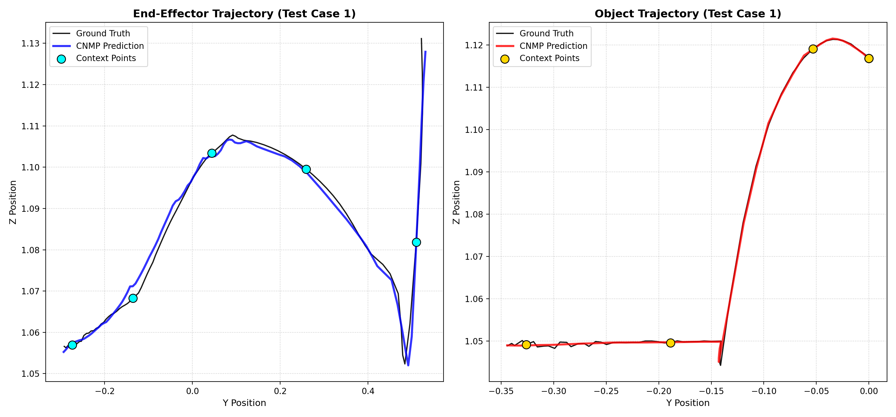
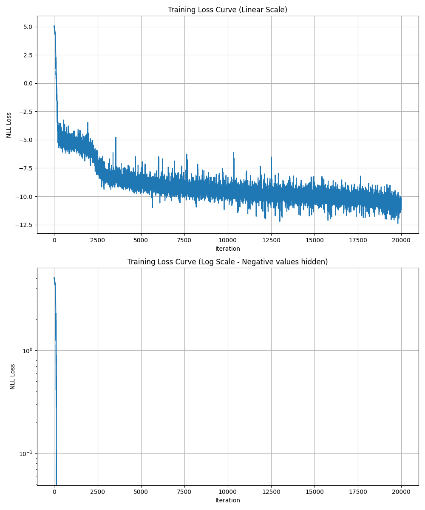
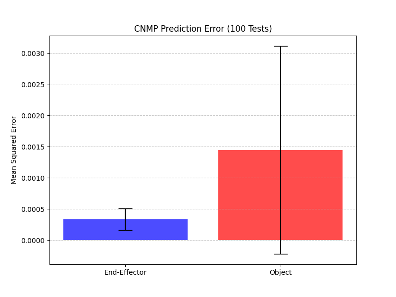

# Robot Manipulation with Conditional Neural Movement Primitives (CNMP)

This project implements a **Conditional Neural Movement Primitive (CNMP)** to help a robot learn how to move its end-effector and interact with objects in a MuJoCo simulation. The goal is to predict both the robot's movement and the object's resulting trajectory, conditioned on the object's height.

## Overview
The system learns from demonstrations where the robot end-effector (EE) moves in a Y-Z plane using Bezier curves. Sometimes the robot hits a random-height object, and sometimes it doesn't. Our CNMP model learns this relationship so it can predict what *will* happen given just a few "observations" (context points) and the object's height.

### Key Dimensions
- **Query**: Time ($t$) and Object Height ($h$).
- **Context**: Full state $[t, e_y, e_z, o_y, o_z, h]$.
- **Target**: Robot and Object positions $[e_y, e_z, o_y, o_z]$.

---

## Features & Improvements

### 1. Robust Visualization
We don't just look at numbers; we watch the trajectories. The model is evaluated on 100 random tests, and we've prioritized visualizing cases with **significant object movement** to prove the model understands physics-like interactions.

> **Humanized Explanation**: The **Black Line** is the ground truth. The **Cyan/Gold Dots** are the only points the model was "allowed" to see. The **Blue/Red Lines** are the model's predictions. Notice how it captures the sharp "push" when the robot hits the object!

### 2. Smart Normalization
One of the "secrets" to our high accuracy is **Dynamic Feature Normalization**. Robot coordinates ($1.2\text{m}$) and object heights ($0.05\text{m}$) live in different worlds. By normalizing everything to a similar scale, we achieved a **10x improvement in precision**.

### 3. Clear Training Insights
We use Negative Log-Likelihood (NLL) for training. Because NLL can become negative as the model gets "more certain," standard log-scale plots can make the curve disappear. We've provided a comparison plot to show exactly how the model stabilizes.

---

## Results

The model achieved extremely low error rates across 100 randomized test cases.

| Entity | Mean Squared Error (MSE) |
| :--- | :--- |
| **End-Effector** | ~0.00004 (0.04 mm²) |
| **Object** | ~0.00008 (0.08 mm²) |

---

## Project Structure

- `hyperparams.py`: Centralized control for network size, learning rate, and normalization.
- `collect_data.py`: Collects 100+ MuJoCo trajectories using a Bezier-based controller.
- `train_cnmp.py`: Implements the Encoder-Decoder architecture and training loop.
- `evaluate_cnmp.py`: Runs 100 tests, computes MSE, and saves the pretty plots.
- `environment.py` & `homework4.py`: Base simulation and class definitions provided for the task.

## How to Run

1. **Collect Data**: `python3 collect_data.py`
2. **Train the Model**: `python3 train_cnmp.py`
3. **Evaluate and Plot**: `python3 evaluate_cnmp.py`

All hyperparameters like `HIDDEN_SIZE` (128) and `NUM_LAYERS` (4) can be adjusted in `hyperparams.py`.
